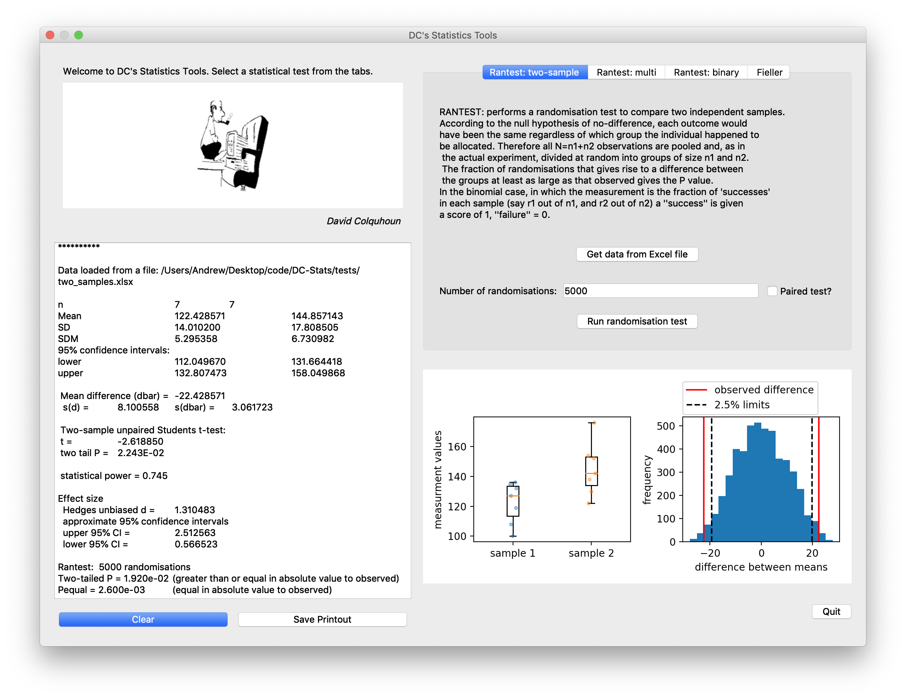

# DC Stats
Python port and extension of David Colquhoun's Statistics Tools

Work porting to Python from original FORTRAN was begun by Remigijus Lape at UCL. 

Qt5 GUI under Python 3.7 is now the preferred environment. 
Dependencies are: pandas, numpy and scipy 
You can get everything you need on any platform quite easily with Anaconda. 

Tested on macOS 10.14 and Windows. Linux should also be fine. 

If you work with Python version 2.7 (as packaged with macOS), you will get the Tkinter GUI that is no longer maintained. This version should work with old versions of OSX like 10.6 though.

Examples of how to use modules are provided in Jupyter notebooks (.ipynb files). 

To run, open the Terminal (Mac/Linux) or cmd.exe (Windows), navigate to the DC-Stats directory and type:

  python DC_Stats.py

You can do a randomization test on continuous or binomial data, and look at Fiellers theorem for the standard deviation of a ratio too. For continuous randomization test, information about effect size (Hedges' unbiased d and its approximate confidence interval from bootstrap) is also included in the output. 

To use data from Excel, save the two sets of values in two columns as tab-delimited text without titles.

## Installation

If you are using 'pip' then the `dcstats` package can be installed locally with (note a space and a dot at the end):

`pip install .`

or

`pip install -e .`

The latter creates symlink which allows any source code change be available locally immediately.

# Projected ongoing development
This software is under development. Output is not fully tested, and therefore you should exercise caution if you plan to use the results for production / publication. 

Batch processing of data is now implemented for Rantest. Intuitive import and export should follow.

